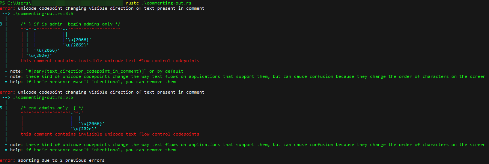

# Rust

## Commenting-Out

- Confirmed working on rustc v1.53.0 (MacOS), but throws unused variable warning
- Confirmed working on rustc 1.48.0 (Ubuntu), but throws unused variable warning
- Does not work on rustc 1.56.1 (59eed8a2a 2021-11-01) (Windows 10.0.19042 Build 19042); has mitigated bidi-related CVE

## Stretched String

- Confirmed working on rustc v1.53.0 (MacOS)
- Confirmed working on rustc 1.48.0 (Ubuntu)
- Does not work on rustc 1.56.1 (59eed8a2a 2021-11-01) (Windows 10.0.19042 Build 19042); has mitigated bidi-related CVE

## Invisible Function

- Does not work on rustc v1.53.0 (MacOS) - throws unknown token error
- Does not work on rustc 1.48.0 (Ubuntu) - throws unknown token error
- Does not work on rustc 1.56.1 (59eed8a2a 2021-11-01) (Windows 10.0.19042 Build 19042) - throws unknown token error

## Homoglyph Function

- Confirmed working on rustc v1.53.0 (MacOS), but throws mixed_script_confusables warning
- Does not work on rustc 1.48.0 (Ubuntu): error[[E0658](https://github.com/rust-lang/rust/issues/55467)]: non-ascii idents are not fully supported
- Confirmed working on rustc 1.56.1 (59eed8a2a 2021-11-01) Windows 10.0.19042 Build 19042, but throws mixed_script_confusables warning

## Rust's mitigation of bidi-attack
Detailed warning by rustc 1.56.1
